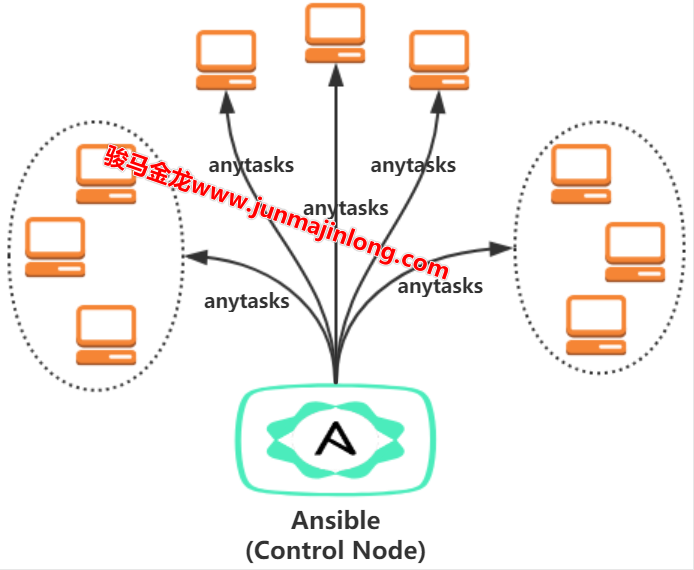

# 学习不迷茫：Ansible 要如何学至精通

## 1.1 Ansible 基本介绍

​ Ansible 是一个基于 Python 开发的配置管理和应用部署工具，现在也在自动化管理领域大放异彩。它融合了众多老牌运维工具的优点，Pubbet 和 Saltstack 能实现的功能，Ansible 基本上都可以实现。

​ Ansible 能批量配置、部署、管理一大堆的主机。比如以前需要切换到每个主机上执行的一或多个操作，使用 Ansible 只需在固定的一台 Ansible 控制节点上去完成所有主机的操作。

​ 例如，下面的操作(看不懂没关系)表示将 Ansible 所在主机上的/etc/my.cnf 文件拷贝到 mysql 主机组内的所有主机的/etc/目录下，mysql 主机组可以是单台主机，也可以是很多台主机，这可以由用户自己来定义。

```shell
$ ansible mysql -m copy -a "src=/etc/my.cnf dest=/etc/"
```

其实，固定在一台主机上去控制其它主机，通过 ssh 工具或一些基于 ssh 二次开发的简单工具也能实现，但 Ansible 吸引人的地方在于它提供的 playbook 能批量整合不同主机上执行的不同任务，同时还提供一些额外的机制让用户可以去协调这些任务的执行策略。



Ansible 是基于模块工作的，它只是提供了一种运行框架，它本身没有完成任务的能力，真正执行操作的是 Ansible 的模块，比如 copy 模块用于拷贝文件到远程主机上，service 模块用于管理服务的启动、停止、重启等。这有点像 Shell，Shell 自身提供的操作是很有限的，但是它提供了一个很友好的平台让实现各种功能的命令得以执行。Ansible 自身可以类比于 Shell 自身，Ansible 的各种模块可以类比于 Shell 下各种命令。

Ansible 其中一个比较鲜明的特性是 Agentless，即无 Agent 的存在，它就像普通命令一样，并非 C/S 软件，也只需在某个作为控制节点的主机上安装一次 Ansible 即可，通常它基于 ssh 连接来控制远程主机，远程主机上不需要安装 Ansible 或其它额外的服务。

Ansible 的另一个比较鲜明的特性是它的绝大多数模块都具备幂等性(idempotence)。所谓幂等性，指的是多次操作或多次执行不影响结果。比如算术运算时数值加 0 是幂等的，无论加多少次结果都不会改变，而数值加 1 是非幂等的，每次加 1 结果都会改变。再比如执行 systemctl stop xxx 命令来停止服务，当发现要停止的目标服务已经处于停止状态，它什么也不会做，所以多次停止的结果仍然是停止，不会改变结果，它是幂等的，而 systemctl restart xxx 是非幂等的。Ansible 的很多模块在执行时都会先判断目标节点是否要执行任务，所以，可以放心大胆地让 Ansible 去执行任务，重复执行某个任务绝大多数时候不会产生任何副作用。

## 1.2 如何学习并学好 Ansible

Ansible 作为一个自动化管理工具，它的用法可以非常简单，只需学几个基本的模块，就像 ssh 命令一样去使用，就能完成一些简单的批量配置管理功能。

它的用法也可以非常难，需要学习大量 Ansible 自身的知识，而且还需要学习 Ansible 中涉及到的额外知识。比较悲催的是 Ansible 的知识体系比较庞大，它的知识板块也比较零散，想要构建一个比较完善的 Ansible 知识体系确实稍有难度，这也往往会让我们对深入 Ansible 无处下手甚至产生迷茫感，相信不少学习过 Ansible 的人对此应该都有所体会。

其实，Ansible 的知识虽多，但这些知识点本身是死的，需要什么功能学什么功能就可以，总有一天可以吞下绝大多数的知识点。但这并不够，实际的环境是非常灵活且复杂的，使用 Ansible 去管理配置时，需要关注很多任务流程和逻辑，如果编写的任务没有逻辑，使用 Ansible 很可能会让你知道一口大锅从天而降是一种什么样的体验，所以需要去协调 Ansible 中的各个任务，协调各个任务是 Ansible 的另一难点。

最后一个难点，我个人认为是写出适合自己公司环境的可复用(即一次编写多次使用)的 playbook 或 role。这要求熟悉如何应对各种需求和逻辑，对知识点也了然于心，这需要很强的综合能力。

所以要掌握 Ansible，需要：

1. 系统性地学习 Ansible，从而构建自己的 Ansible 知识体系

   - (1).学基本用法和常用模块
   - (2).学 Ansible 涉及到的额外知识，如 YAML 和 JinJa2
   - (3).学习零散但却重要的边角知识点，比如 delegate_to、run_once
   - (4).了解一些高级玩法或很少用的上的功能

2. 真实应用 Ansible 去配置管理各类服务并协调好任务逻辑，保证 Ansible 的执行逻辑不会影响业务

总结起来，就是一句在座的各位听了估计会很想打人的废话：理论和实践相结合。

虽然确实是废话，但却是真理，学习总是离不开理论和实践的，缺了任何一环，都会遇到难点和瓶颈。对 Ansible 的学习也如此，想要通过 Ansible 来释放自己，并让 Ansible 完美地执行各个任务，不仅要求 Ansible 的功力要达到一定层次，还需要实际的经验来理解任务逻辑。

为了达到理论和实践相结合的目标，需要你我双方共同的努力。

对于我而言，为了让各位不打我，我会尽最大的努力，安排好知识点的出场顺序(正如人生的出场顺序，知识点的出场顺序也很重要)，同时辅以一些我精心挑选的经典案例来解释用法、适用场景并为大家详细解说任务之间的逻辑，从而循序渐进地逐步掌握 Ansible 的知识点，最终系统性地掌握 Ansible，并熟悉 Ansible 的正确使用姿势。

对于各位读者而言，要深入掌握 Ansible，需要自己去练习、测试、并记下属于自己的笔记(杜绝完全拷贝粘贴)，我能提供给各位的是知识的展现和引导，缺少了各位自己的练习和自己的笔记，这一切都是空话。
